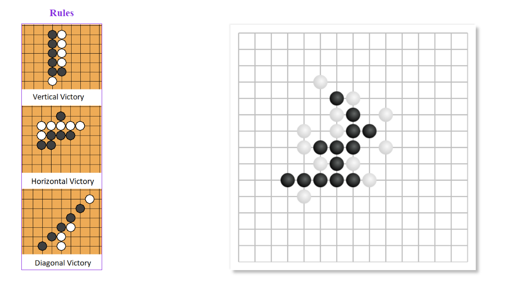

A Gomoku game implemented with vanilla JavaScript.
Click [here](https://lukeouyang.github.io/gomoku/) to try.

###The AI strategy
win-oriented: check all possible move and ranked them by
1. The Shortest path to AI win status (1-step, 2-step, 3-step)
2. Cut player-win (score by blocking 5-sequence, 4-sequence,3-sequence)

For the matching pair from rule 1 and rule 2, such as "1-step win" and blocking 5-sequence, score for rule1 is greater than its score of rule2;
score of blocking 5-sequence is greater than winning in 2-steps;
So we can illustrate the order of scores as follows:
1-step-win > blocking 5-seq > 2-step-win > blocking 4-sequence ....
